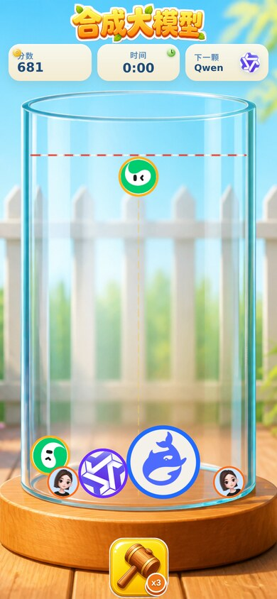
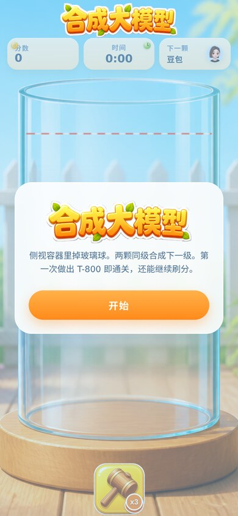

# 训练大模型

侧视容器里往下掉玻璃球，两颗同级合成下一级。第一次做出 **T-800** 即通关，之后可以继续刷分。休闲局，不是刷分肝游。

<p align="center">
  
  
</p>

完整玩法见 [docs/BRIEF.md](docs/BRIEF.md)。图标出处见 [docs/ASSET_SOURCES.md](docs/ASSET_SOURCES.md)。

## 这是什么仓库

这是一个 **Godogen 薄仓库（thin repo）**：先用 Godogen 的 publish.sh 写入运行时清单和引擎指南，再由宿主 agent 在仓库里把游戏本身搭出来。

源仓库：`/workspace/godogen-src`

发布命令（只做一次，不要 --force 以免清掉游戏文件）：

```
/workspace/godogen-src/publish.sh --engine babylon --agent codex --out /workspace/merge-models
mkdir -p .cursor/skills
cp -R .agents/skills/asset-gen .cursor/skills/asset-gen
```

发布后仓库里自带：

| 文件 | 作用 |
|---|---|
| `AGENTS.md` | Codex 运行时清单（怎么判断进度、资产怎么生成） |
| `babylon.md` | Babylon.js 引擎指南（Vite、Havok wasm、侧效 import、截图） |
| `.agents/skills/asset-gen` | Codex 资产技能 |
| `.cursor/skills/asset-gen` | 同一技能的 Cursor 副本，方便本机宿主用 |

游戏代码、Vite 脚手架、图标、简报都是发布之后写进去的，不是 Godogen 自带的。

## 和官方 Godogen 的差异

| 点 | 官方 Godogen | 本仓库 |
|---|---|---|
| 宿主 | Claude Code 或 Codex CLI | Cursor 宿主（skills 同步到 `.cursor/skills`） |
| 付费资产 | asset-gen（Gemini / Grok / Tripo3D），先问再花 | **不用付费资产生成**。十个官方图标已经收集好了 |
| 端口 | 指南里写 5173 | **5175**（避开其他 Vite） |
| gitignore | 默认忽略 AGENTS.md / babylon.md / .agents（可再发布） | 工程化仓库，这些文件入库，方便阅读 |
| 证明方式 | 无人值守时录 15-20s 视频 | 可玩页面 + 风格确认截图 screenshots/ui-play.png |

## 怎么跑

需要 Node 22+。在仓库根目录安装依赖后执行开发服务器（脚本名 dev）。

打开 **http://127.0.0.1:5175**。`vite.config.ts` 绑定 `host: true`、`port: 5175`、`allowedHosts: true`。

`build` 脚本跑 tsc + vite，只当编译门禁，不是「能玩」的证明。

Havok wasm 放在 `public/HavokPhysics.wasm`，运行时用 locateFile 加载 `/HavokPhysics.wasm`（包的 exports 会挡住 url import）。

## 怎么玩

1. 标题页点「开始」。
2. 左右移动手持球，松手 / 点击 / 空格投放。只能投 1-4 级。
3. 两颗同级碰到变成下一级，中央 toast 显示名字。
4. 第一次做出 T-800 即通关结算。可选「继续刷分」或「再来一局」。
5. 球顶越过警戒线约 2 秒即失败（刚落下穿过红线不算）。
6. 点锤子，再点一颗已落地的球砸碎（全局限 3 次）。点空处取消。

桌面：A / D 或方向键或鼠标移动；点击 / 空格投放。
手机：手指拖动手持球，松手投放。画布禁止滚动和缩放。
点击后在点击处的 X 下落；倾斜手机可轻微拨动罐里已落下的球。

音频在第一次手势时解锁。

## 源码地图

```
src/
  main.ts                 启动：canvas、Engine、进 createApp
  app/createApp.ts        建场景、开 Havok、挂 Game 与 HUD
  game/
    Game.ts               阶段机：title / playing / won / dead / hammerAim
    constants.ts          容器尺寸、警戒线、锤子数、静止阈值
    tiers.ts              10 级：id、中文名、半径、质量、图标
    scoring.ts            10*n*n、连击 1.25、首杀 T-800 +3000 + 时间奖励、双 T-800 +5000
    spawn.ts              下一颗队列，仅 1-4 级，权重 35/30/20/15
    physics.ts            Havok 隐形盒墙；罐子是关卡贴图
    merge.ts              同级接触 → 下一级上弹；两颗 T-800 消失
    hammer.ts             3 锤子：瞄准 → 点已落地的球 → 碎裂 VFX
    failLine.ts           靠近变红 + 警报；静止越线约 2s 失败
    TokenLayer.ts         2D 圆片层：图标铺满 + 分阶色圈，叠在院子图上
  ui/                     HTML/CSS 覆盖层：分数、计时、下一颗、锤子、toast、胜负
  audio/Sfx.ts            Web Audio 程序音：碰撞、合成、碎裂、警报、胜利
  assets/icons/           01-doubao.png … 10-t800.png
  assets/levels/          01-courtyard.png（院子+画上的玻璃缸）
  assets/ui/              title.png、hammer.png
```

玩法细则只放在 `docs/BRIEF.md`，避免和代码各说各话。

## 资源表

| 游戏内 | 文件 | 来源 |
|---|---|---|
| 1 豆包 | `src/assets/icons/01-doubao.png` | 豆包官网 apple-touch |
| 2 元宝 | `src/assets/icons/02-yuanbao.png` | 腾讯元宝标（LobeHub SVG 转 512） |
| 3 Qwen | `src/assets/icons/03-qwen.png` | 通义官方 lockup 裁切 |
| 4 Kimi | `src/assets/icons/04-kimi.png` | Moonshot 官方 Branding Guide 圆形图标 |
| 5 DeepSeek | `src/assets/icons/05-deepseek.png` | Wikimedia DeepSeek-icon.svg |
| 6 Gemini | `src/assets/icons/06-gemini.png` | Wikimedia Google Gemini icon 2025 |
| 7 Grok | `src/assets/icons/07-grok.png` | xAI 官方 brand-kit logomark |
| 8 ChatGPT | `src/assets/icons/08-chatgpt.png` | Wikimedia ChatGPT-Logo.svg |
| 9 Claude | `src/assets/icons/09-claude.png` | Wikimedia Claude AI symbol |
| 10 T-800 | `src/assets/icons/10-t800.png` | 端头像（ICON HEAD），不是博物馆老照片 |
| 出处全文 | `docs/ASSET_SOURCES.md` | 从 merge-assets/SOURCES.md 拷来 |

T-800 用 merge-assets 里的 10-t800.png（与 10-t800-icon.png 相同）端头像。不要用 Tekniska museet 那张旧静物照。

演示 / 编辑用途。商标仍归各权利人。

## 移动端

- index.html：viewport-fit=cover，禁止用户缩放。
- canvas：touch-action none，overscroll-behavior none。
- HUD 按 390px 宽排：顶栏分数 / 时间 / 下一颗，底栏一只锤子 ×3。
- 锤子按钮足够大，方便拇指。
- 覆盖层用大号按钮和对比度足够的字。

## 视觉

日光院子，不是夜间霓虹。白 / 米色圆角条、气泡立体字、软阴影。罐子是淡 U 玻璃缸（木底座、没有盖）。球是 2D 圆片：图标铺满，外圈分阶色。标题「合成大模型」。

截图：`docs/shots/play.jpg`、`docs/shots/title.jpg`。

## 现状

院子和罐子是 `01-courtyard.png` 的 HTML 图，物理墙隐形。圆片画在 2D overlay 上，滚动时图标跟着转。碰撞音是玻璃珠互撞，停稳的堆不再连响。

## 自动部署

推到 `master`，或打任意 tag，会跑 GitHub Actions：在 runner 上构建 nginx 镜像，scp 到 CVM，`docker load` 后 `compose up`。也可在 Actions 页手动 `workflow_dispatch`。不走腾讯云 TCR。

仓库 Secrets：GitHub → 本仓库 Settings → Secrets and variables → Actions。需要这三项：

### `HOST`
CVM 公网 IP。腾讯云控制台实例详情里复制。

### `SSH_USER`
CVM 上用来 SSH 登录的 Linux 用户名，**不是**在 GitHub 里生成的。腾讯云 Ubuntu 镜像默认一般是 `ubuntu`，CentOS 常见 `root`。控制台「登录」或你平时 `ssh 用户名@IP` 用的那个。

也可以单独建一个部署用户（在 CVM 上执行）：

```bash
sudo adduser --disabled-password --gecos "" deploy
sudo usermod -aG docker deploy
```

然后 Secret 里 `SSH_USER` 填 `deploy`。

### `RSA_PRIVATE_KEY`
给 GitHub Actions 专用的 SSH **私钥**全文。名字沿用旧项目 file-upload，密钥算法用 ed25519 即可。**不要**把日常登录电脑的那把私钥贴进去，也**不要**把私钥提交进仓库。

在本机生成一对（空密码）：

```bash
ssh-keygen -t ed25519 -C "merge-models-github-actions" -f merge-models-deploy -N ""
```

会得到：
- `merge-models-deploy` — 私钥。打开全文，粘到 GitHub Secret `RSA_PRIVATE_KEY`（包含 `BEGIN`/`END` 那几行）。
- `merge-models-deploy.pub` — 公钥。拷到 CVM 上 `SSH_USER` 的授权文件：

```bash
# 在 CVM 上，以 SSH_USER 登录后
mkdir -p ~/.ssh
chmod 700 ~/.ssh
echo '这里换成 .pub 文件那一行' >> ~/.ssh/authorized_keys
chmod 600 ~/.ssh/authorized_keys
```

本机自测：`ssh -i merge-models-deploy SSH_USER@HOST` 能进再放到 Secret。测完可以把本机那份私钥删掉，只留 GitHub Secret 和 CVM 上的公钥。

CVM 还要：已装 Docker 和 Compose，安全组放行 22 和 **18447**（不要开 80），并 `mkdir -p ~/demo`。容器映射 `18447:80`。打开 `http://HOST:18447`。
